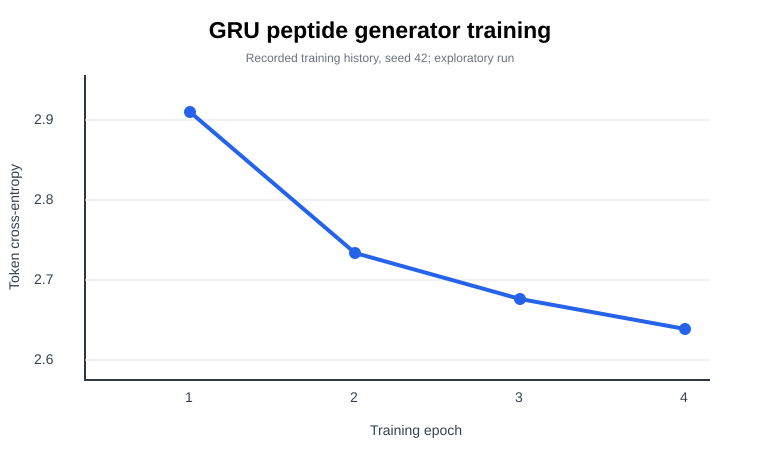

# Experimental summary

These results were obtained from a single exploratory run using the original local dataset and seed 42.

| Measure | Result |
|---|---:|
| Curated unique sequences | 3,834 |
| Predictor training sequences | 2,453 |
| Predictor validation sequences | 614 |
| Predictor test sequences | 767 |
| Test MAE (log10 µM) | 0.4353 |
| Test R² | 0.5308 |
| Sampled generator sequences | 350 |
| Unique valid novel-by-exact-match sequences | 343 |

The plot is a vector recreation from the recorded epoch-level training history. Other diagnostic PNG figures can be regenerated locally with `python make_figures.py` after the training script has produced its CSV outputs.

**Important:** A random sequence split is not a homology-controlled test. Predicted potency is not measured potency. No biological activity or safety claim is made.
